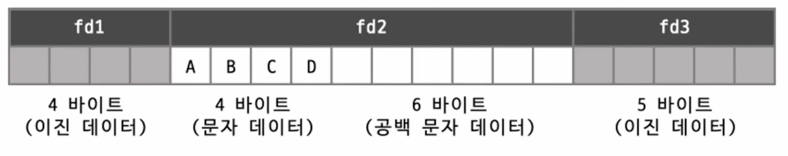
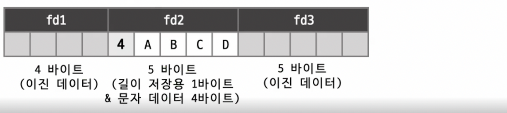
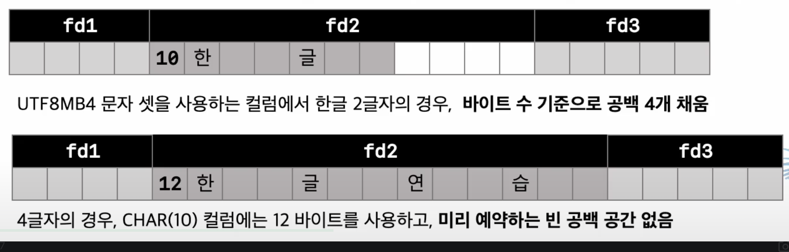
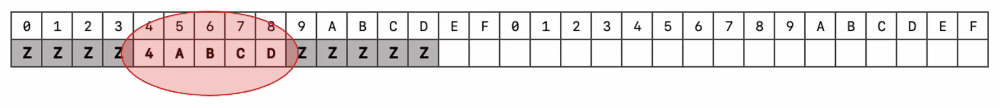
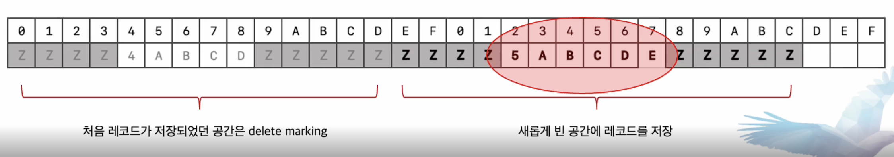

###  공통점
- 문자열  저장용 컬럼
- 최대 저장 가능 문자 길이 명시(byte 수 X)
	- `character set` 에 따라 사용하는 저장 공간의 크기가 다름
	- ex) CHAR(10), VARCHAR(10)
	- `latin1`: 최대 10글자 저장 가능, 10 bytes 사용
	- `utf8mb4` : 최대 10글자 저장 가능, 10~40 bytes 사용
		- 가변 길이 문자 셋(영어 10글자 저장하면 10 bytes 사용, 한글 10글자 저장 30 bytes, 이모지 저장시 최대 40 bytes 까지 사용)

---
### 차이점

|                  | CHAR                                                                                               | VARCHAR                                                                  |
| ---------------- | -------------------------------------------------------------------------------------------------- | ------------------------------------------------------------------------ |
| 공간 할당            | 저장된 문자 길이와 상관없이 최대 설정된 크기만큼 할당                                                                  | 저장된 문자길이 만큼만 저장 공간 할당                                                    |
| 최대 저장길이          | CHAR(255)                                                                                          | VARCHAR(16383) -> 65535 bytes                                            |
| 저장된 값 길이 관리여부 | 가변길이 문자 셋을 사용할 경우에만 관리 0 ~ 255 bytes (length-bytes : 1) 256 ~ 65535 bytes (length-bytes : 2) | 0 ~ 255 bytes (length-bytes : 1) 256 ~ 65535 bytes (length-bytes : 2) |

---
### 저장 공간

#### Latin1
- CHAR(10)
	- ABCD 저장시 10 bytes 공간 할당 4 bytes 사용, 6 bytes 공백

- VARCHAR(10)
	- ABCD 저장시 4 bytes 만 할당하여 사용, 실제 저장된 문자열의 byte 길이를 저장하여 관리

#### UTF8MB4
- VARCHAR(10)
	- 문자당 bytes 수가 달라도 문자 셋 관계없이 필요한 만큼만 할당하여 사용

- CHAR(10)
	- 가변길이 문자셋 이므로 저장된 데이터 길이를 저장하여 관리
	- '한글' 저장 시 6 bytes 를 사용하므로 4 bytes 의 공백 사용
	- '한글연습' 저장시 12 bytes 를 사용하므로 예약 공간 사용 X

---
### CHAR 타입의 공간 낭비
- 일반적으로 고정된 길이의 값 저장 `CHAR`, 그 외의 경우 -> `VARCHAR` 타입

#### CHAR 대신 VARCHAR 타입 사용
- CHAR 타입의 경우 
	- 저장되는 문자열의 최소 최대 길이 가변 폭이 큰 경우(e.g. 1~100) 공간 낭비 큼
	- 저장되는 문자열의 최소 최대 길이 가변 폭이 작은 경우(e.g. 90~100) 공간 낭비 작음

---
### 컬럼 값의 길이 변경시 작동 방법

 - VARCHAR(10) 레코드 INSERT

- VARCHAR(10) 레코드 UPDATE (ABCD -> ABCDE)

- 기존 공간은 삭제하고 새로운 공간에 레코드를 저장
- 구조가 계속 변경 되므로 새로 저장된 공간을 찾기 어려워짐

---
### CHAR 타입을 선택하는 경우
- 값의 가변 길이 범위 폭이 좁고, 자주 변경되는 경우(특히 인덱스된 컬럼인 경우)
- 이 경우에 VARCHAR 사용시
	- 데이터 페이지 내부의 조각화 현상이 증가
	- CHAR 타입보다 공간 효율이 떨어짐
	- 내부적으로 빈번한 Page Reorganize 작업 필요

