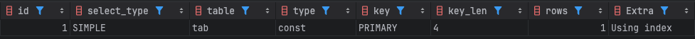
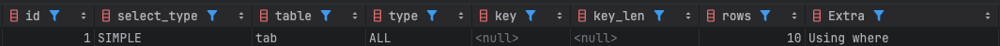
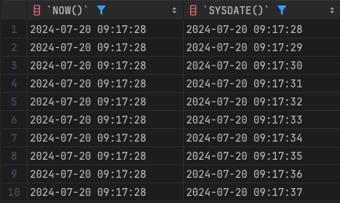

### MySQL Function
- Built-in Function
- User Defined Function(UDF)
- Stored Function
---
### Deterministic vs Not Deterministic
- Deterministic (확정적)
	- 동일 상태와 동일 입력으로 호출하는 경우 항상 동일한 결과 반환
	- 함수의 인자 뿐만 아니라 함수가 참조하는 데이터도 포함
- Not Deterministic (비확정적)
	- 입력이 동일하더라도 호출되는 시점에 따라서 결과가 달라질 수 있는 경우

```mysql
-- DETERMINISTIC
CREATE
	DEFINER = root@'localhost'
	FUNCTION func1() RETURNS INTEGER
	DETERMINISTIC SQL SECURITY INVOKER
BEGIN
	SET @func1_called = IFNULL(@func1_called, 0) + 1;
	RETURN 1;
END ;;

-- NOT DETERMINISTIC
CREATE
	DEFINER = root@'localhost'
	FUNCTION func2() RETURNS INTEGER
	NOT DETERMINISTIC SQL SECURITY INVOKER
BEGIN
	SET @func2_called = IFNULL(@func2_called, 0) + 1;
	RETURN 1;
END ;;
```

#### DETERMINISTIC 함수 호출 시
- 한건 만 조회 
```mysql
EXPLAIN SELECT * FROM tab WHERE id=func1();  
```


#### NOT DETERMINISTIC 함수 호출 시
- 테이블 풀스캔이 일어남
```mysql
EXPLAIN SELECT * FROM tab WHERE id=func2();  
```


---
### NOT DETERMINISTIC 최적화 이슈
- NOT DETERMINISTIC 함수의 결과는 비확정적
- 매번 호출 시점마다 결과가 달라질 수 있음
	- 비교 기준 값이 상수가 아니고 변수
	- 매번 레코드를 읽은 후, WHERE 절을 평가할 때마다 결과가 달라질 수 있음
	- 인덱스에서 특정 값을 검색할 수 없음
	- 인덱스 최적화 불가능

---
### NOT DETERMINISTIC bulit-in 함수
- RAND()
- UUID()
- SYSDATE()
- NOW()
- `WHERE col=(RAND()*1000)`과 같이 조건절에 사용이 되면 비교되는 컬럼의 인덱스를 사용하지 못하게 되므로 주의

#### NOW() vs SYSDATE()
- 동일하게 현재 일자와 시간을 반환
- 두 함수 모두 NOT DETERMINISTIC 함수
- `NOW()` 함수
	- DETERMINISTIC 처럼 동작
	- 하나의 Statement 내에서는 Statement 의 시작 시점 반환
- `SYSDATE()` 함수
	- 매번 함수 호출 시점 반환

```mysql
SELECT NOW(), SYSDATE(), SLEEP(1) FROM tab LIMIT 10;
```


- `created_at` 컬럼에 `index` 를 가진 테이블에서 `WHERE` 절에서 `NOW()` 를 사용하면 인덱스를 사용하지만 `SYSDATE()` 함수를 사용하면 인덱스를 사용하지 못하고 풀스캔을 해야함
```mysql
-- ADD INDEX ix_createdat(created_at)
SELECT * FROM tab WHERE created_at = NOW();
SELECT * FROM tab WHERE created_at = SYSDATE();
```

- `sysdate-is-now` 설정의 옵션을 추가하면 `SYSDATE()`함수도 `DETERMINISTIC` 처럼 동작하게 됨

---
### Stored Function 주의사항
- 옵션이 명시되지 않으면 기본적으로 NOT DETERMINISTIC 으로 인식
- Stored function 생성시 기본 옵션에 명시를 하여 사용해야 함