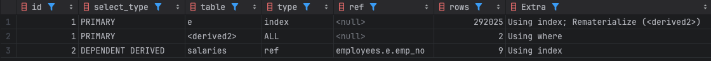

- `Derived Table`(파생 테이블)은 쿼리의 `FROM` 절에서 서브쿼리를 통해 생성되는 임시 테이블을 의미
- 일반적으로 `Derived Table`은 선행 테이블의 컬럼을 참조할 수 없으나, `Lateral Derived Table`은 참조 가능
- 정의된 `Derived Table` 앞부분에 `LATERAL` 키워드를 추가해서 사용
- 참조한 값을 바탕으로 동적으로 결과 생성

---
### 동작 방식
- derived table
```mysql
SELECT e.emp_no, s.period  
FROM employees e  
LEFT JOIN (  
    SELECT COUNT(*) AS period  
    FROM salaries  
    WHERE emp_no = e.emp_no  
) s ON TRUE;
```
- 선행 테이블의 컬럼을 참조할 수 없음
```mysql
[42S22][1054] Unknown column 'e.emp_no' in 'where clause'
```

- lateral derived table
```mysql
SELECT e.emp_no, s.period  
FROM employees e  
LEFT JOIN LATERAL (  
    SELECT COUNT(*) AS period  
    FROM salaries  
    WHERE emp_no = e.emp_no  
) s ON TRUE;
```


---
### Lateral Derived Table 활용
#### 종속 서브 쿼리의 다중 값 반환
- 부서별 가장 먼저 입사한 직원의 입사일과 직원 이름을 조회하는 쿼리
```mysql
SELECT d.dept_name,  
       (SELECT e.hire_date                            AS earliest_hire_date,  
               CONCAT(e.first_name, ' ', e.last_name) AS full_name  
        FROM dept_emp de  
                 INNER JOIN employees e ON e.emp_no = de.emp_no  
        WHERE de.dept_no = d.dept_no  
        ORDER BY e.hire_date  
        LIMIT 1)  
FROM departments d;
```
- `SELECT` 절에서 서브쿼리를 사용하는 경우 하나의 컬럼 값만 반환 가능
```mysql
[21000][1241] Operand should contain 1 column(s)
```

- Lateral Derived Table 활용
```mysql
SELECT d.dept_name,  
       x.earliest_hire_date,  
       x.full_name  
FROM departments d  
INNER JOIN LATERAL (  
    SELECT e.hire_date                            AS earliest_hire_date,  
           CONCAT(e.first_name, ' ', e.last_name) AS full_name  
    FROM dept_emp de  
             INNER JOIN employees e ON e.emp_no = de.emp_no  
    WHERE de.dept_no = d.dept_no  
    ORDER BY e.hire_date  
    LIMIT 1  
) x;
```

#### SELECT 절 내 연산 결과 반복 참조
- 일별 매출 데이터를 조회하는 쿼리
```mysql
-- SELECT 문 내에서 연산 결과를 참조하기 위해 동일한 연산을 중복 사용
SELECT (total_sales * margin_rate)                                          AS profit,  
       ((total_sales * margin_rate) / total_sales_number)                   AS avg_profit,  
       (expected_sales * margin_rate)                                       AS expected_profit,  
       ((total_sales * margin_rate) / (expected_sales * margin_rate) * 100) AS sales_achievement_rate  
FROM daily_revenue  
WHERE sales_date = '2024-01-01';
```

- Lateral Derived Table 활용
```mysql
-- FROM 절에서 LATERAL 키워드를 사용해 연산 결과 값을 참조
SELECT profit,  
       avg_profit,  
       expected_profit,  
       sales_achievement_rate  
FROM daily_revenue,  
     LATERAL ( SELECT (total_sales * margin_rate) AS profit) p,  
     LATERAL ( SELECT (profit * total_sales_number) AS avg_profit) ap,  
     LATERAL ( SELECT (expected_sales * margin_rate) AS expected_profit) ep,  
     LATERAL ( SELECT (profit * expected_profit * 100) AS sales_achievement_rate) sar  
WHERE sales_date = '2024-01-01';
```

#### 선행 데이터를 기반으로 한 데이터 분석
- 처음 서비스에 가입하고 나서 일주일 내로 결제 완료한 사용자의 비율
	- 2024년 1월에 가입한 유저들을 대상으로 분석
	- 사용자 관련 이벤트 데이터를 저장하는 `user_events` 테이블을 활용
```mysql
SELECT SUM(sign_up)                                  AS signed_up,  
       SUM(complete_purchase)                        AS completed_purchase,  
       (SUM(complete_purchase) / SUM(sign_up) * 100) AS conversion_rate  
FROM (SELECT user_id, 1 AS sign_up, MIN(created_at) AS sign_up_time  
      FROM user_events  
      WHERE event_type = 'SIGN_UP'  
        AND created_at >= '2024-01-01'  
        AND created_at < '2024-02-01'  
      GROUP BY user_id) e1  
         LEFT JOIN (SELECT 1 AS complete_purcase, MIN(created_at) AS complete_purchase_time  
                    FROM user_events  
                    WHERE event_type = 'COMPLETE_PURCHASE'  
                    GROUP BY user_id) e2 ON e2.uesr_id = e1.user_id  
    AND e2.complete_purchase_time >= e1.sign_up_time  
    AND e2.complete_purchase_time < DATE_ADD(e1.sign_up_time, INTERVAL 7 DAY);
```
-> `user_events` 테이블에서 결제에 해당하는 전체의 데이터들에 대해 그룹핑을 수행하기 때문에 비효율 발생

- Lateral Derived Table 활용
```mysql
SELECT SUM(sign_up)                                  AS signed_up,  
       SUM(complete_purchase)                        AS completed_purchase,  
       (SUM(complete_purchase) / SUM(sign_up) * 100) AS conversion_rate  
FROM (SELECT user_id, 1 AS sign_up, MIN(created_at) AS sign_up_time  
      FROM user_events  
      WHERE event_type = 'SIGN_UP'  
        AND created_at >= '2024-01-01'  
        AND created_at < '2024-02-01'  
      GROUP BY user_id) e1  
         LEFT JOIN LATERAL (SELECT 1 AS complete_purcase  
                            FROM user_events  
                            WHERE user_id = e1.user_id  
                              AND event_type = 'COMPLETE_PURCHASE'  
                              AND created_at >= e1.sign_up_time  
                              AND created_at < DATE_ADD(e1.sign_up_time, INTERVAL 7 DAY)  
                            ORDER BY event_type, user_id, created_at  
                            LIMIT 1  
    ) e2 ON TRUE;
```
-> 두 번째 테이블에서 분석 대상 유저들에 대해서만 추가적으로 조건을 확인하므로 효율적

#### Top N 데이터 조회
- 카테고리별 조회수가 가장 높은 3개 기사 추출
```mysql
SELECT x.name, x.title, x.views  
FROM (SELECT c.name,  
             a.title,  
             a.views,  
             ROW_NUMBER() OVER  
                 (PARTITION BY a.category_id ORDER BY a.views DESC ) AS article_rank  
      FROM categories c  
               INNER JOIN articles a ON a.category_id = c.id) x  
WHERE x.article_rank <= 3;
```
-> `articles` 테이블을 먼저 읽으면서 내부적으로 정렬 후 `categories` 테이블과 조인
-> `articles` 테이블의 전체 데이터를 읽어서 처리하므로 비효율적

- Lateral Derived Table 활용
```mysql
SELECT c.name, a.title, a.views  
FROM categories c  
         INNER JOIN LATERAL ( SELECT category_id, title, views  
                              FROM articles  
                              WHERE category_id = c.id  
                              ORDER BY category_id DESC, views DESC  
                              LIMIT 3  
    ) a;
```
-> `categories` 테이블을 먼저 읽고 각 데이터 별로 `articles` 테이블 데이터 조회
-> `articles` 테이블에서 전체 데이터가 아닌 카테고리 별 원하는 데이터 3건에 대해서만 읽으므로 효율적