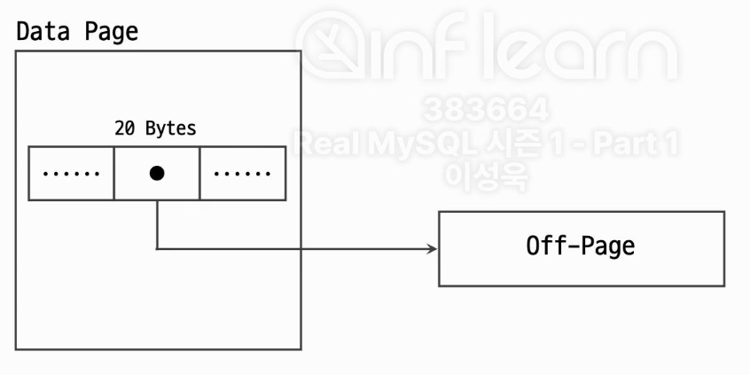

### 공통점
- 문자열 속성 값을 저장
- 최대 65535 Bytes 까지 저장 가능

---
### 차이점
- VARCHAR 타입 컬럼에는 지정된 글자 수 만큼만 데이터 저장 가능
	- VARCHAR(10) -> 10글자 이하만 저장 가능
- TEXT 타입 컬럼은 인덱스 생성 시 반드시 Prefix 길이 지정 필요
	- CREATE INDEX ix_text_column ON table(text_column(100));
- TEXT 타입 컬럼은 표현식으로만 디폴트 값 지정 가능
	- CREATE TABLE tb1 (col TEXT DEFAULT 'abc') -> 에러 발생
	- CREATE TABLE tb1 (col1 TEXT DEFAULT ('abc')) -> 생성 가능
	
---
### VARCHAR vs TEXT
- 일반적인 사용 형태
	- 길이가 짧으면 VARCHAR 타입, 길이가 길면 TEXT 타입
- VARCHAR(5000) vs TEXT 
	- VARCHAR 타입은 메모리 버퍼 공간을 미리 할당해두며 재활용 가능
	- TEXT 타입은 그때 그때 필요한 때마다 할당 & 해제
	- 컬럼 사용이 빈번하고 메모리 용량이 충분하다면 VARCHAR 타입 추천
	- VARCHAR(5000)과 같이 길이가 긴 컬럼들을 자주 추가하는 경우, Row 사이즈 제한(65,535 Bytes)에 도달할 수 있으므로 적절하게 TEXT 타입과 같이 사용하는 것을 권장
- VARCHAR(30) vs VARCHAR(255)
	- 실제 최대 사용하는 길이만큼 명시해야 메모리 사용 효율 증가
	- 저장된 데이터의 길이를 저장하는 디스크 공간 효율 차이도 미미하게 존재 (1 Byte vs 2 Bytes)

---
### 주의사항
- 저장되는 값의 사이즈가 크면 Off-Page 형태로 데이터가 저장 될 수 있음
	- MySQL의 InnoDB 스토리지 엔진은 하나의 레코드 크기가 데이터 페이지의 절반 크기보다 큰 경우에는 레코드에서 외부로 저장할 가변 길이 컬럼을 선택하게 되고 그렇게 선택된 컬럼은 별도 외부 페이지에 데이터가 저장
	- 본래의 데이터 페이지에는 외부 페이지를 가리키는 포인터 값만 저장

- 쿼리에서 Off-Page 컬럼의 참조 여부에 따라 쿼리 처리 성능이 달라짐
	- 데이터 페이지 외에도 외부 페이지도 조회 하기 때문

---
### 정리
- 상대적으로 저장되는 데이터 사이즈가 많이 크지 않고, 컬럼 사용이 빈번하며 DB 서버의 메모리 용량이 충분하다면 VARCHAR 타입 권장
- 저장되는 데이터의 사이즈가 큰 편이고, 컬럼을 자주 사용하지 않으며 테이블에서 다른 문자열 컬럼들이 많이 사용되고 있는 경우 TEXT 타입 권장
- VARCHAR 타입을 사용하는 경우, 길이는 실제 사용되는 만큼만 지정
- 쿼리의 SELECT 절에는 가능하면 필요한 컬럼들만 명시하는 것이 좋음
	- 테이블에 대형 데이터 저장 컬럼 존재 시 쿼리 처리 성능 저하
	- 필요한 컬럼만 명시하면 커버링 인덱스 방식으로 처리 될 가능성