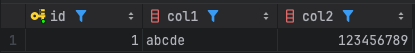
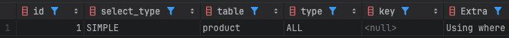

### Generated Column
- 표현식으로 정의된 컬럼
- 정의된 표현식에 따라 컬럼의 값이 자동으로 생성
	- 표현식: 고정된 값, 함수 또는 다른 컬럼들에 대한 연산 조합 등이 해당
- 사용자가 직접 값을 입력하거나 변경할 수 없음
- 두가지 종류가 존재
	- Virtual Generated Column (가상 컬럼)
	- Stored Generated Column (스토어드 컬럼)
- 표현식에 비결정적 함수, 스토어드 프로그램, 변수, 서브쿼리 사용 불가
- `INSERT`/`UPDATE` 시 `Generated Column` 에 직접 값을 지정할 수 없고 `DEFAULT` 만 가능
#### Generated Column 생성
- 기본적으로 `VIRTURE` 타입으로 생성, `NULL` 값 허용
- `PRIMARY KEY` 로는 `STORED` 타입만 허용
- 하나의 테이블에서 `VIRTURE` 컬럼과 `STORED` 컬럼 혼합해서 사용 가능
```mysql
col_name data_type [GENERATED ALWAYS] AS (expr)
	[VIRTUAL | STORED] [NOT NULL | NULL]
	[UNIQUE [KEY]] [[PRIMARY] KEY]
	[COMMENT 'string']
```

```mysql
ALTER TABLE test ADD COLUMN generated_column AS (col1 + col2) VIRTUAL;
```
#### 가상 컬럼(Virtual Generated Column)
- 컬럼의 값을 디스크에 저장하지 않음
- 컬럼의 값은 레코드가 읽히기 전 또는 `BEFORE` 트리거 실행 직후에 계산됨
- 인덱스 생성 가능
	- 인덱스 데이터는 디스크에 저장
	- 인덱스에 새로운 값이 저장되거나 변경될 때 값 계산이 수행
	- 인덱스를 통해 값을 읽는 경우에는 값을 계산하지 않고 인덱스 값을 읽음
```mysql
CREATE TABLE tb_virtual_column  
(  
    id          int NOT NULL AUTO_INCREMENT,  
    price       int NOT NULL DEFAULT 0,  
    quantity    int NOT NULL DEFAULT 0,  
    total_price int GENERATED ALWAYS AS ((quantity * price)) VIRTUAL,  
    PRIMARY KEY (id),  
    KEY ix_totalPrice (total_price)  
);
```
#### 스토어드 컬럼(Stored Generated Column)
- 컬럼의 값을 디스크에 저장
- 컬럼의 값은 레코드가 INSERT 되거나 UPDATE 될 때 계산되어 저장
- 인덱스 생성 가능
```mysql
CREATE TABLE tb_virtual_column  
(  
    id          int NOT NULL AUTO_INCREMENT,  
    price       int NOT NULL DEFAULT 0,  
    quantity    int NOT NULL DEFAULT 0,  
    total_price int GENERATED ALWAYS AS ((quantity * price)) STORED,  
    PRIMARY KEY (id),  
    KEY ix_totalPrice (total_price)  
);
```
#### Generated Column DDL 작업
- `ALTER` 명령으로 `ADD`/`MODIFY`/`CHANGE`/`DROP`/`RENAME` 가능
- 일반 컬럼을 스토어드 컬럼으로, 스토어드 컬럼을 일반 컬럼으로 변경 가능
	- 가상 컬럼은 일반 컬럼으로 전환 불가
- 스토어드 컬럼 <-> 가상 컬럼 간 변경 불가
	- 새로 컬럼을 추가하고 삭제하는 방식으로만 전환 가능

Online DDL
- 테이블의 구조를 변경(스키마 변경)을 실행하는 도중에도, `INSERT나` `UPDATE와` 같은 `DML`들을 실행할 수 있도록 해주는 기능

| 작업 종류         | INSTANT | INPLACE | REBUILD 테이블 | DML 허용 | 메타데이터만 변경 |
| ------------- | ------- | ------- | ----------- | ------ | --------- |
| 스토어드 컬럼 추가    | X       | X       | O           | X      | X         |
| 스토어드 컬럼 순서 변경 | X       | X       | O           | X      | X         |
| 스토어드 컬럼 삭제    | X       | O       | O           | O      | X         |
| 가상 컬럼 추가      | O       | O       | X           | O      | O         |
| 가상 컬럼 순서 변경   | X       | X       | O           | X      | X         |
| 가상 컬럼 삭제      | O       | O       | X           | O      | O         |
- Online DDL 작업 시 자동으로 선택된 방식이 예상했던 것과는 다를 수 있으므로 DDL 명령에 실행 알고리즘을 직접 명시하는 것을 권장
```mysql
-- 일반적인 실행 형태
ALTER TABLE test ADD COLUMN virtual_column AS (col1 + col2) VIRTUAL;

-- 알고리즘 직접 명시해서 실행
ALTER TABLE test
	ADD COLUMN virtual_column (col1 + col2) VIRTUAL, ALGORITHM=INSTANT;

ALTER TABLE test
	ADD COLUMN virtual_column (col1 + col2) VIRTUAL, ALGORITHM=INPLACE, LOCK=NONE;
```

가상 컬럼 추가 또는 변경 시 (ADD/CHANGE/MODIFY) 사용 가능한 유효성 검사 옵션
- WITHOUT VALIDATION
	- 기본 설정
	- 기존 데이터 무결성 확인하지 않으며, 가능한 경우 i`n-place` 방식으로 작업 수행
	- 계산된 값이 컬럼의 값 범위를 벗어날 수 있음(경고 또는 에러 발생 가능)
- WITH VALIDATION
	- 데이터 테이블 복사 수행하므로 처리시간이 오래 걸림
	- 작업중 `DML` 유입 시 잠금 대기(메타데이터 락 대기) 발생
	- 작업 시 계산된 값이 컬럼의 값 범위를 벗어나는 경우 명령문 실패
	
```mysql
CREATE TABLE t1  
(  
    id   int NOT NULL AUTO_INCREMENT,  
    col1 varchar(10) DEFAULT NULL,  
    col2 int         DEFAULT NULL,  
    PRIMARY KEY (id)  
);
```


without validation 사용
```mysql
ALTER TABLE t1  
    ADD COLUMN v_col int AS (CAST(CONCAT(col1, col2) AS UNSIGNED)) VIRTUAL,  
    WITHOUT VALIDATION;
```
- 실행은 성공하지만 예상과는 다른 값이 출력


with validataion 사용
```mysql
ALTER TABLE t1  
    ADD COLUMN v_col int AS (CAST(CONCAT(col1, col2) AS UNSIGNED)) VIRTUAL,  
    WITH VALIDATION;
```
- 에러 발생
```mysql
[22001][1292] Data truncation: Truncated incorrect INTEGER value: 'abcde123456789'
```
#### Generated Column 인덱스 사용
- 일반 컬럼과 동일하게 쿼리에서 인덱스 가능
- 쿼리에 `Generated` 컬럼명 대신 표현식을 사용해도 인덱스 사용 가능
	- 표현식은 컬럼에 정의된 표현식과 완전히 일치해야 함
	- 컬럼에는 `(col1 + 1)`로 정의되어 있으나 쿼리에서 `(1 + col1)` 로 사용 시 사용 불가
	- 주어진 조건 값과 컬럼 타입도 동일해야 함
- =, <, <=, >, >=, BETWEEN, IN 연산자 사용 시에만 적용

```mysql
CREATE TABLE product  
(  
    id          int NOT NULL AUTO_INCREMENT,  
    price       int NOT NULL DEFAULT 0,  
    quantity    int NOT NULL DEFAULT 0,  
    total_price int GENERATED ALWAYS AS ((quantity * price)) STORED,  
    PRIMARY KEY (id),  
    KEY ix_totalPrice (total_price)  
);
```

컬럼명 사용
```mysql
EXPLAIN SELECT * FROM product WHERE total_price >= 300000 AND total_price < 500000;
```


같은 표현식 사용
```mysql
EXPLAIN SELECT * FROM product WHERE (quantity * price) >= 300000 AND (quantity * price) < 500000;
```


다른 표현식 사용
```mysql
EXPLAIN SELECT * FROM product WHERE (price * quantity) >= 300000 AND (price * quantity) < 500000;
```


다른 타입 사용
```mysql
EXPLAIN SELECT * FROM product WHERE (quantity * price) >= '300000' AND (quantity * price) < '500000';
```


---
### Function Based Index(Functional Index)
- `MySQL 8.0.13` 버전부터 도입
- 일반 인덱스는 컬럼 또는 컬럼의 prefix 만 인덱싱 가능
```mysql
CREATE INDEX ix_col ON tab(col);
CREATE INDEX ix_col20 ON tab(col(20));
```
- 함수 기반 인덱스는 표현식을 인덱싱 값으로 사용 가능
```mysql
CREATE INDEX f_index ON tab((col1 + col2), (col1 * col2));
CREATE INDEX f_index ON tab(DATE(col));
```
- 쿼리의 조건절에서 컬럼을 가공하는 경우에 사용 가능
```mysql
-- 사용하는 쿼리
SELECT * FROM tab WHERE (col1 + col2) > 10;

-- 쿼리를 위한 인덱스
CREATE INDEX f_index ON tab ((col1 + col2));
```
- 각각의 표현식은 반드시 괄호로 묶어서 명시
- 일반 컬럼과 함께 복합 인덱스로 구성 가능
- 표현식 값에 대해 ASC & DESC 지정 가능
- UNIQUE 설정 가능

#### 동작 방식
- Virtual Generated 컬럼을 자동 생성 후 인덱싱
- 자동 생성된 Virtual 컬럼은 일반적인 환경에서는 확인 불가
```mysql
SET SESSION debug='+d, show_hidden_columns';
```
- 가상 컬럼의 이름은 `!hidden!index_name!key_part!counter` 형태로 지정되며 타입도 자동 지정 됨
	- index_name: 인덱스명
	- key_part: 가상 컬럼으로 생성되는 인덱스 키파트 순서
	- counter: 컬럼명 중복시 하나씩 증가

#### 활용 예시
- 문자열 값의 특정 부분에 대해서 조회
```mysql
CREATE INDEX ix_email_domain ON users( (SUBSTRING_INDEX(email, '@', -1)));

CREATE INDEX ix_address_depth2 ON stores
	( (SUBSTRING_INDEX( SUBSTRING_INDEX(address, ' ', 2), ' ', -1 ) );
```
- 일/월/연도 별 조회
```mysql
CREATE INDEX ix_createdat_day ON events ( (DAY(created_at)) );
CREATE INDEX ix_createdat_month ON events ( (MONTH(created_at)) );
CREATE INDEX ix_createdat_year ON events ( (YEAR(created_at)) );
```
- 대소문자 구분 없이 문자열 검색
```mysql
CREATE INDEX ix_title ON books ( (LOWER(title)) );
```
- 계산된 값 조회
```mysql
CREATE INDEX ix_discounted_price ON products ( (price * (1 - discount_rate)) );
```
- 해싱된 값 조회
```mysql
CREATE INDEX ix_config_md5 ON metadata ( (MD5(config)) );
```

#### 주의 사항
- 인덱스 생성 후 실행 계획을 반드시 확인
- 표현식을 정확하게 명시해야 인덱스 사용 가능
```mysql
CREATE TABLE test  
(  
    id   int NOT NULL AUTO_INCREMENT,  
    col1 int DEFAULT NULL,  
    PRIMARY KEY (id),  
    KEY ix_col1_plus_1 (((col1 + 1)))  
);

-- O
SELECT * FROM test WHERE (col1 + 1) < 3000; 

-- X
SELECT * FROM test WHERE (1 + col1) < 3000; 
```
- 표현식 결과의 데이터 타입을 명확하게 확인해서 조건값 지정
```mysql
CREATE TABLE test  
(  
    id   int NOT NULL AUTO_INCREMENT,  
    created_at datetime DEFAULT NULL,  
    PRIMARY KEY (id),  
    KEY ix_createdat_month ((MONTH(created_at)))  
);

-- O 
SELECT * FROM test WHERE MONTH(created_at) = 2;

-- X
SELECT * FROM test WHERE MONTH(created_at) = '2';
```
- 표현식 결과의 데이터 타입을 확인하는 방법
	- `--column-type-info` 사용
- 기본적으로 일반 인덱스보다 추가적인 계산 비용이 발생
	- 변경이 잦은 컬럼 & 복잡한 표현식 사용 시 오버헤드가 커질 수 있음
- 표현식에 비결정적 함수 사용 불가
- 일반 컬럼 및 `prefix` 길이 지정된 컬럼은 키 값으로 지정 불가
	- 괄호 없이 사용하거나 `SUBSTRING` 또는 `CAST` 함수를 사용
- 공간 인덱스나 전문검색 인덱스는 지원하지 않음
- `primary key` 에 표현식은 포함 불가